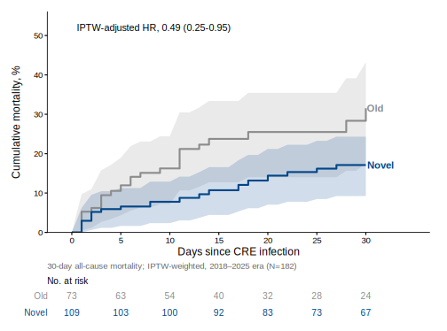
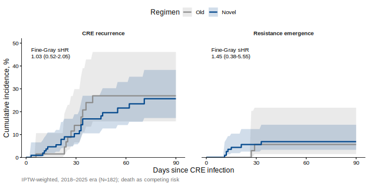
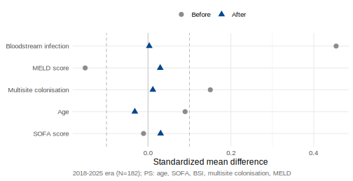
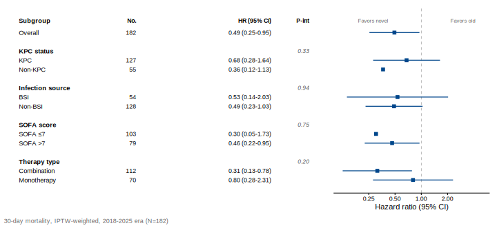
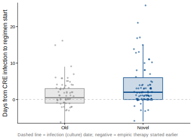
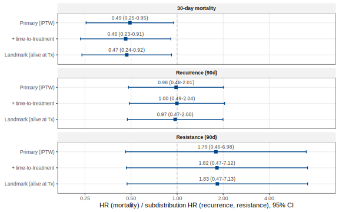

This page presents the primary analysis restricted to the **2018–2025 cohort (N = 182)**, in which
both older and novel regimens were used. Because novel agents were unavailable before 2018, a
whole-cohort comparison would violate the positivity assumption and mix treatment with calendar era
(and the 2010–2017 records also incompletely ascertained recurrence and resistance). Restricting to
the contemporaneous era gives the valid, ascertainment-consistent comparison. Figures are generated
by [`analysis.R`](analysis.R) from `CRECOOLT_onlyinfections.sav`.

::: {.callout-note}
## Design

- **Cohort:** CRE infection, 2018–2025 (74 older, 109 novel).
- **Primary endpoint:** 30-day all-cause mortality from CRE infection (IPTW-weighted Cox).
- **Secondary endpoints:** 90-day CRE recurrence and resistance emergence (IPTW Fine–Gray, death as a competing risk).
- **Propensity score (5 covariates):** age, SOFA, bloodstream infection, multisite colonisation, MELD; stabilized weights targeting the average treatment effect.
:::

## Primary endpoint — 30-day mortality

Novel regimens were associated with roughly half the 30-day mortality of older regimens (crude
32.9% vs 15.6%). After IPTW adjustment, the **hazard ratio was 0.49 (95% CI 0.25–0.95; p = 0.035)**.

{#fig-mortality}

## Secondary endpoints — recurrence and resistance (90 days)

With death treated as a competing event, neither late-stage endpoint differed between regimens:
recurrence **sHR 0.98 (95% CI 0.48–2.01)**, resistance **sHR 1.79 (95% CI 0.46–6.98)**. The
resistance estimate rests on only 11 events and is correspondingly imprecise.

{#fig-secondary}

## Covariate balance

Inverse-probability-of-treatment weighting achieved good balance on all five propensity-score
covariates (maximum \|SMD\| well within the 0.10 threshold).

{#fig-love}

## Consistency across subgroups

The 30-day mortality benefit was consistent across pre-specified subgroups, with no significant
interactions.

{#fig-forest}

## Sensitivity — time from infection to regimen

A potential concern is immortal-time bias or confounding from the interval between infection onset
and regimen start. In this cohort that interval was short and only modestly different (median 0.5 d
older vs 2 d novel), and for a substantial minority therapy began empirically at or before the
culture date (negative values). Critically, **only 1 of 38 deaths occurred before treatment
started**, so immortal-time exposure is negligible.

{#fig-ttt}

All three endpoints were **robust** to this timing: additionally adjusting for time-to-treatment,
and a landmark analysis restricted to patients alive at treatment start, left every estimate
essentially unchanged. Because novel-regimen patients were treated slightly *later* yet died
*less*, any residual confounding by delay biases against — not toward — the observed benefit.

{#fig-sens}

## Interpretation

Within the contemporaneous 2018–2025 cohort — the comparison that respects treatment availability
and consistent outcome ascertainment — novel regimens approximately halved 30-day mortality, while
rates of CRE recurrence and emergence of resistance were comparable to older regimens. All figures
are reproducible via `source("analysis.R")`.
