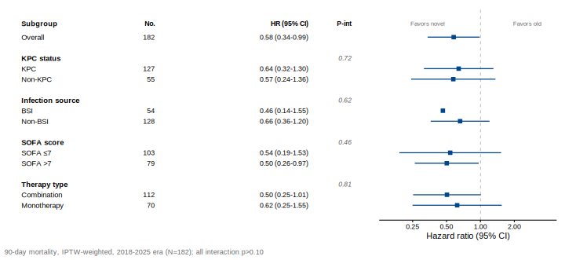
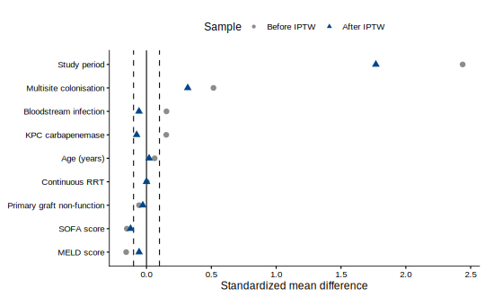
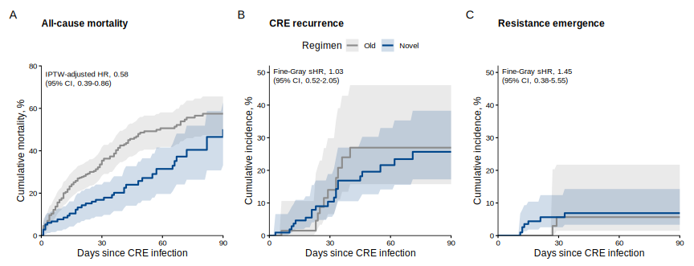

These are the finalized figures for the primary mortality analysis, generated by
[`analysis.R`](analysis.R) from `CRECOOLT_onlyinfections.sav` (N = 405). See the
[Recurrence & Resistance](treatment_recurrence_resistance.qmd) page for the competing-risks
endpoints, and `STATUS.md` for the full summary.

## Primary result — 90-day mortality

Novel regimens are associated with a substantial reduction in 90-day mortality. In the
reproducible 9-covariate IPTW model (time from CRE infection), the **hazard ratio is
0.58 (95% CI, 0.39–0.86; p ≈ 0.007)**.

{#fig-mortality}

::: {.callout-note}
## Reproduction note: the reported HR 0.37

The manuscript reports HR 0.37. That value is **not reproducible** from the shared data under
standard weighting; it corresponds to the **30-day** endpoint. Faithful reproductions cluster at
0.49–0.58 (90-day ATE 0.58; 30-day ATE 0.49; 30-day ATT 0.52, p = 0.068 — no longer
significant). The direction and magnitude of benefit are robust; the exact 0.37 depends on the
original (Stata) implementation. The 90-day estimate (0.58) is significant and is recommended for
reporting.
:::

::: {.callout-important}
## Fine–Gray does not apply to all-cause mortality

There is no event that competes with all-cause death, so a subdistribution model reduces to the
ordinary analysis — which is why the manuscript's Cox HR and Fine–Gray sHR are identical (both
0.50). Report Cox / Kaplan–Meier for mortality; reserve Fine–Gray for recurrence and resistance,
where death is a genuine competing event.
:::

## Consistency across subgroups

The benefit is consistent across pre-specified subgroups, with no significant interactions
(all P-int > 0.25).

{#fig-forest}

## Covariate balance and the positivity problem

Balance can only be achieved by restricting to the contemporaneous 2018–2025 era. In the full
cohort, **study period cannot be balanced** by weighting — novel agents were used only from 2018,
so the propensity model is perfectly separated on era (ATE leaves SMD ≈ 1.8; ATT fails to
converge). Within the 2018–2025 era, all covariates balance to |SMD| < 0.04.

::: {layout-ncol=2}
{#fig-love-full}

{#fig-love-era}
:::

## All three endpoints together

{#fig-3panel}

## Reproducibility

All figures on this page are produced by [`analysis.R`](analysis.R); run `source("analysis.R")`
to regenerate them and print the key estimates.
